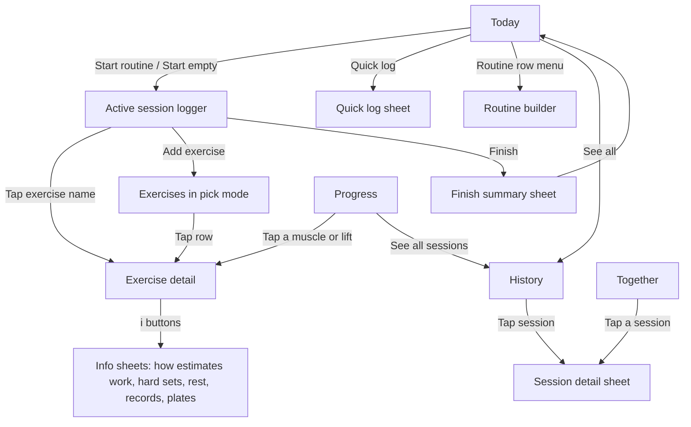

# Homebase workout mode: the spec

Written 2026-09-12. Companion file: `evidence.json` (the only list of science the app may use).

**How to read this.** Plain words first, exact detail second. Every factual statement carries a tag:

- **[verified]** read in the code, a license file, a paper, or checked with a script.
- **[assumed]** reasoned but not reproduced. Treat as a hypothesis and test it first.
- **[untested]** needs a real phone or a real person before anyone can say it works.
- **[convention]** our own rule. No study behind it. Never shown with a science badge.

Science claims carry their grade from `evidence.json`: **A** tested over weeks, **B** measured in one workout, **C** reasoned, not tested.

Nothing in this spec was run against Supabase or the live app. No app source file was changed.

---

## 1. The one job

**Workout mode has one job: make logging a real set take one tap, and make what you logged honest and useful afterwards.**

Everything else (the library, the science pages, progress) exists to feed that tap with the right defaults or to read the result back truthfully.

### Who each screen serves

| Person | Situation | What they need | Measure of success |
|---|---|---|---|
| **Gino** (Android, 4-day Upper/Lower split, lifts weights) | Mid-set in a gym. Sweaty, one hand, phone on a bench, 90 seconds between sets. | Last time's numbers already in the row. One big tick. Rest timer that starts itself and survives the screen turning off. Plates worked out. Honest records. | A normal working set logged with **one tap** when he repeats last time, **three taps** when he changes the weight. |
| **Xinyan** (iPhone, home bodyweight/band circuit, walking) | At home or just back from a walk. No gym, no barbell. Wants it done. | Recent activities one tap away with last values filled in. "Same as last time" for her circuit. No weight fields where there is no weight. | A walk or her usual circuit logged in **about ten seconds, three taps**. |

Screen by screen:

| Screen | Mainly for | Why |
|---|---|---|
| Today (home) | both | Start or log fast. Xinyan's "Quick log" and "Same as last time" live here. |
| Active session logger | Gino | The one-tap set. The most important screen. |
| Quick log sheet | Xinyan | Ten-second logging. |
| Exercises (library) | both | Find and add an exercise, browse by body area or equipment. |
| Exercise detail + infographic | both | "What does this work, and what do studies actually say?" |
| Progress | Gino mostly | Weekly hard sets per muscle, strength trend, records. |
| History | both | Every past session, editable, backdatable. |
| Routine builder | Gino mostly | Plan sets, rep ranges, rest and supersets. |
| Together | both | See each other's week. Read-only for the other person's data. |

---

## 2. Information architecture

### 2.1 How you move around

The bottom bar stays as it is (Meals, Workouts) [verified: `HealthView.tsx` `SECTIONS`]. Inside Workouts, the existing "Just me / Together" control becomes one four-part control using the existing `.h-seg` class:

**Today · Progress · Exercises · Together**

Saved per phone in `hb-workout-view`. On first load, an old saved `hb-workout-mode = "together"` maps to Together, anything else to Today [convention].



**While a session is running** and you switch to Progress, Exercises or Together, a slim bar stays at the top: "Workout in progress · 0:32 · Resume". The rest timer dock stays visible on every view [convention].

Sheets use the existing centred sheet shape (accent top edge, 22px radius) [verified: look extract C16]. Settings uses the existing bottom sheet shape.

### 2.2 Today (home)

Top to bottom, in priority order:

1. **Unfinished session banner** (only if one exists from an earlier day): "Unfinished workout from Tue 9 Sep · Finish it · Discard". Today it would wrongly show as "Today's workout" forever [verified: `WorkoutSection.tsx:109, :391`].
2. **Hero** (existing `.h-hero` + `.h-week`): big number = days trained in the last 7 days, "of 4 days" (goal per person, Gino 4, Xinyan 2 by default [convention]), the 7-square strip. The label changes from "this week" to **"last 7 days"**, because the count is a rolling 7 days, not a calendar week [verified: `workoutLog.ts:108-119`].
3. **Two big buttons side by side:** "Start **Upper B**" (next routine, see §5.5) and **"Quick log"**. Below them a text link "Start an empty workout". Start buttons are disabled until the store has loaded, so a second active session can't be created [assumed bug: `loading` unused, `WorkoutSection.tsx:121`].
4. **Routines** list (existing row style C11). Tap = start. Row menu (⋯): Edit, Duplicate, **Log as done, same as last time** (only if a finished session with that name exists), Delete (with confirm).
5. **Recent sessions**: last 3, each "Upper A · Tue · 18 sets · 52 min". "See all" opens History.

No volume number on this screen. The old "vol" figure adds pounds×reps to bare reps and is removed (see §5.3).

### 2.3 Active session logger (the most important screen)

Replaces Today while a session is running.

**A. Session bar** (sticky top, `.h-hero` shell, compact):
- Session name (tap to rename; today it can't be renamed [verified: `:391`]).
- Elapsed time, sets done / sets planned.
- **Finish** (filled accent button, right).
- ⋯ menu: Save as routine, Session note, Discard workout (asks to confirm: "Discard this workout? Sets you logged will be deleted." · Discard · Keep) [verified that today Discard deletes instantly: `:400`].

**B. Exercise cards**, in order. On opening, the first card with an unticked set scrolls into view.

Card header, left to right:
- Exercise name (tap opens Exercise detail).
- One faint line under it: **"Last time (Tue): 185×5 · 185×5 · 185×4"**.
- If part of a superset: a 2px `--color-taupe` rule down the left edge of every card in the group, and an eyebrow "Superset A" [convention; no hue, see §9].
- ⋯ menu: Note, Rest time for this exercise (with "Timer off"), Superset with next, Move up, Move down, Swap exercise (keeps sets and typed numbers), Plate calculator (barbell-type equipment only), Remove (with Undo).

Set rows. One row per set, on a 343px phone column:

| Column | Width | What it does |
|---|---|---|
| Set number | 28px | Shows 1, 2, 3… or **W** (warm-up), **D** (drop), **F** (failure). Tap opens a small menu: Warm-up / Working / Drop set / To failure. |
| Weight | flex | Number input, decimals allowed (17.5, 1.25). Suffix "lb" or "kg". **Hidden** for bodyweight and timed exercises. For band exercises it becomes a band label chip ("Red") instead of a weight, because band colour is not a weight (claim `band-colour-not-weight`, B). |
| Reps | flex | Number input. For timed exercises it becomes seconds with a small ▶ that counts up in the row; tapping it again stops and fills the seconds. |
| Reps left | 40px | Only if "Ask reps left" is on. Shows "–" or the number. |
| Tick | 48×48px | The one main action. Undone: ring in accent at 40% (tappable). Done: filled `--h-good` with a check. |

**Pre-filled values ("ghosts").** Every empty input shows a faint suggested value [convention, order fixed]:
1. The same set number from the last finished session with this exercise (warm-ups matched to warm-ups, working to working).
2. Otherwise the previous ticked row in this session.
3. Otherwise the routine's target reps (top of the range) and no weight.

Typed values are bone at weight 600; ghost values are `--color-faint`. The difference is colour **and** weight, so it survives a sweaty glance.

**What one tap on the tick does**, in order:
1. Empty inputs take their ghost values. If a weighted exercise still has no weight, the weight input shakes and shows "Enter a weight"; nothing is saved.
2. The set gets `done: true` and `doneAt` = now.
3. The session is saved to the phone at once (§8) and to the server after the existing 700 ms wait.
4. Rest timer starts (§7), unless the exercise's timer is off or this set is inside a superset round that isn't finished.
5. Android: a 30 ms buzz (only while the app is on screen) [verified API support; untested on his phone].
6. Records check (§5.4). A real rep record shows a small **"Record"** tag on the row. An estimated record shows **"Best estimate (est.)"**. First-ever sets of an exercise never celebrate [convention].
7. If "Ask reps left" is on and the set is not a warm-up, a chip row slides open under the set: **"Reps left in the tank: 0 · 1 · 2 · 3 · 4+ · skip"**. It never blocks: ticking the next set closes it and leaves effort "not logged".
8. In a superset, the view scrolls to the next exercise in the group with an unticked set. After the last exercise of the round, the rest timer starts with the longest rest in the group.

**Add set** copies the last row's typed values into ghosts only (not as done). **Remove set** and **Remove exercise** act at once and show a 5-second snackbar "Removed · Undo" [convention; today they delete with no confirm or undo, verified `:479, :495`].

Cardio and walks: one row with minutes (and steps for walking) and a tick.

**C. Add exercise** button under the last card (filled accent when the session is empty, ghost style otherwise, as today).

**D. Rest dock** (§7): fixed just above the bottom tab bar, full column width. While resting: big `1:24` countdown, a thin bar, **−15**, **+15**, **Skip**. When not resting: "Session 0:42 · 14 sets". Thumb reach is at the bottom, so the timer controls are too.

### 2.4 Finish summary (sheet)

1. One line: "52 min · 18 sets · 5 exercises". Time = last tick minus session start (§5.5).
2. **Records this session**: real rep records first, then estimated ones marked "est.".
3. **Hard sets by muscle today**: top 6 muscles as text, e.g. "Upper chest 4 · Front delts 2 · Triceps long head 2".
4. **Unticked sets**:
   - Sets with no typed numbers are removed.
   - Sets with typed numbers but no tick are listed with one switch, "Count 2 unticked sets as done", default on [convention].
5. Session note (textarea).
6. **Save workout** (primary). "Back to workout" (link).

Finishing with zero ticked sets asks: "Nothing was logged. Discard this workout?" (today an empty-but-planned session counts as a day with "12 sets" [verified: `:155-162`]).

### 2.5 Quick log (sheet), built for Xinyan

1. **Recent** chips: her last 8 different activities, each with last values, e.g. "Walk · 30 min", "Band row · 3×12".
2. Search box (English and reviewed Chinese names).
3. After picking: a short form already filled with last time's values:
   - Timed or cardio: minutes presets 15/30/45/60, optional steps.
   - Sets: sets × reps (× weight only for weighted exercises).
   - **Date: Today · Yesterday · Pick** (backdating, which the app can't do today [verified: `:570`]).
4. **Log it**.

Path for a repeat walk: Quick log → "Walk · 30 min" → Log it. **Three taps** [untested with Xinyan].

Path for her usual circuit: Today → routine ⋯ → "Log as done, same as last time" → a snackbar "Logged Home strength · Undo". **Three taps.**

### 2.6 Exercises (library)

1. Search box. Matches English name, aliases, reviewed Chinese name, muscle names, equipment.
2. **Body area chips**: All · Chest · Back · Shoulders · Arms · Core · Legs · Cardio · Stretching.
3. **Equipment chips**: Bodyweight · Band · Dumbbell · Barbell · Cable · Machine · Kettlebell · Other.
4. **Map** toggle: front and back figure. Tap a muscle region to filter. Results split into "Main muscle" and "Also helps".
5. With no search and no filter: **Recent** (last 10 used), **Your exercises** (custom ones, §4.5), then everything by body area, A–Z.

Each row: name; faint line "Main: Glutes, Quads · Barbell"; at the right, faint text "2 study notes" when the exercise has kept exercise-level claims. No colour coding.

**Pick mode** (from the logger): every row has a + button. Tapping a row opens its detail with "Add to workout" at the top.

Custom exercise: when a search finds nothing, "Add '…' as your own exercise" opens a small form: name, main muscles, helper muscles (tap regions on the map), equipment, type of logging (weight / bodyweight / band / timed / cardio).

### 2.7 Exercise detail

Top to bottom:
1. **Header**: name, "Barbell · Squat pattern", back button, "Add to workout" when relevant, and one faint line "Your last time: 185×5 · Tue".
2. **Infographic** (§3): body map → how the joints move → where it works hardest (only when backed by a claim) → what studies found (or the honest "no study notes" line) → how to do it.
3. **Your history** (weighted exercises): rep records table (best weight for 1, 3, 5, 8, 10, 12 reps), estimated-max trend chart, last 5 sessions. Bodyweight: most reps. Timed: longest hold. Band: most reps per band label.

### 2.8 Progress

Period switch: **Last 7 days** (default) · **Last 4 weeks** (average per week).

1. **Body heatmap of hard sets** (front and back). Fill steps from `--h-hl` to `--color-bone` (§3.7). Tap a region to see its exercises.
2. **Hard sets per muscle** list. Each row:
   - muscle name
   - value, e.g. "12.5"
   - a bar with small tick marks at 4, 10 and 18
   - the band label from §5.2 in plain words
   - a faint note when sets with no effort logged are included ("includes 3 sets, effort not logged")

   Below the list:
   - "Sets with no muscle detail: 3". These are custom or unmatched exercises that count toward nothing on the map.
   - An **ⓘ** that opens the "Hard sets" info sheet (§5.6).
3. **Lifts**: pick an exercise (default: the 6 he does most). Estimated-max trend chart, rep records table, recent records with dates (today the record date is stored but never shown [verified: `:271-293`]).
4. **Bodyweight and timed records** for Xinyan's exercises.

No "train this muscle more often" nudge: frequency has no clear effect on growth when weekly sets are equal (claim `F1`, A), so v1 does not nag about it.

### 2.9 History and session detail

- **History**: every finished session, grouped by month, 30 at a time with "Show more" (today only 12 are reachable [verified: `:306`]). Row: name, date, "18 sets · 52 min" or "30 min walk", and "2 records" if any.
- **Session detail sheet**: read view first, **Edit** button for your own sessions. In edit mode you can:
  - rename
  - **change the date**
  - add, remove and edit exercises and sets
  - change set types and reps left
  - write notes
  - Delete (two-step confirm)

  The draft resets only when a different session opens, never when the store refreshes. Today a sync from the other phone can wipe unsaved edits [assumed bug: `:527-530`].

### 2.10 Routine builder

1. Name.
2. Exercise rows, each with:
   - name (tap to swap)
   - sets (stepper)
   - reps range low–high, or seconds for timed
   - rest (shows the default in faint text until changed)
   - "Superset with next" switch
   - ▲ ▼ to reorder
   - remove
3. "Add exercise" (library pick mode).
4. Save.

- Seed routines stay in code and can't be edited [verified]. Their menu shows "Make a copy to edit".
- Saving a routine with a name that already exists asks "Replace it / Save as new" (today repeated taps make duplicates [verified: `:166-175`]).
- Routines need an update path in the store, which doesn't exist today [verified: `HealthStore.tsx` add and delete only].
- No time estimate is shown. Reviewers of MacroFactor complained about wildly wrong estimates [verified: research reviews].

### 2.11 Together

1. **Hero**: "Both of you: 5 training days in the last 7". Two tiles, each with the person's name, days / their goal, and **"Training now"** if they have an unfinished session today. Colours come from tokens only; the hardcoded `#ffe7d4`, `#cdfff5` and `text-white` are removed [verified: `:720, :731`].
2. **Feed**: both people's finished sessions, newest first, 30 at a time. Tap opens the read-only session detail.
3. (Later, not v1) two small body maps side by side for the week.

You never edit the other person's data.

### 2.12 Workout settings (bottom sheet, from Today ⋯)

- Weight unit: lb / kg.
- Ask "reps left" after each set: on/off (default per decision 4).
- Keep screen on during workouts: on/off (default on).
- Rest alerts when the screen is off: Android only. It shows the permission state and a "Turn on" button. On iPhone the row reads "Not available on iPhone yet" (§7).
- Weekly goal: 1–7 days.
- Body figure: male / female (default Gino male, Xinyan female, changeable).
- Bars and plates: bar weight per equipment type (barbell default 45 lb / 20 kg; EZ bar, trap bar and Smith machine have **no default**, you must enter yours, because they vary); plate counts you own.
- About: "Exercise data by RepDB (repdb.co)" link, body map credit (MIT), science register date.

Stored per phone in localStorage `hb-workout-settings-<person>` [convention; each phone belongs to one person].

---

## 3. The per-exercise infographic

One vertical stack inside `.h-panel` cards. Every block has a text version; the drawings are hidden from screen readers (`aria-hidden`) and the text carries the meaning.

### 3.1 Block A: the body map ("Muscles used")

**Figure.** Front and back side by side, each about 150px wide and 240px tall on a 375px phone. Path data comes from react-native-body-highlighter (MIT, pinned commit `15df9e2d`), generated into `src/lib/bodyMap.ts` [verified license and sizes: taxonomy research].

**Encoding: texture, not colour** [verified contrast at 1× in all three themes: taxonomy research]:

| Role | Fill | Contrast vs silhouette |
|---|---|---|
| Not involved | `var(--h-hl)` on `var(--color-tile)` | 1.50 / 1.60 / 1.84 : 1 (quiet on purpose) |
| **Main** | solid `var(--color-bone)` | 9.76 / 9.24 / 8.74 : 1 |
| **Helps** | 45° stripes of bone over `--h-hl`, stripe about 42% of the repeat, repeat 26 drawing units, plus a thin bone outline | same 8.7–9.8 : 1 |

Only two levels. No percentages anywhere: activation numbers don't reliably predict growth (claim `hipthrust-emg-not-growth`, A).

**Legend** directly under the figure: a solid swatch "Main", a striped swatch "Helps".

**Text line** (always present): "Main: Glutes, Quads (rest of thigh) · Helps: Hamstrings, Lower back".

**Hip flexors can't be drawn** (deep muscle). When involved, the text line says "Hip flexors (deep, not shown on the drawing)".

**Tag** on this block: **"Anatomy"** (a neutral text chip, not a science badge), with the line: "Which muscles move the joints in this exercise. This is not a claim about how much each one grows."

### 3.2 Block B: how the joints move

One or two short lines from the exercise's movement pattern, describing the lifting phase. Tag: "Anatomy".

| Pattern | Text |
|---|---|
| squat | Hips straighten · Knees straighten |
| lunge | Hips and knees straighten, one leg at a time |
| hinge | Hips straighten · Knees stay nearly straight |
| hip thrust / bridge | Hips straighten |
| knee extension | Knees straighten |
| knee flexion | Knees bend |
| calf raise | Ankles point, heels rise |
| horizontal push | Arms move forward · Elbows straighten |
| vertical push | Arms rise overhead · Elbows straighten |
| horizontal pull | Arms pull back · Shoulder blades squeeze together · Elbows bend |
| vertical pull | Arms pull down · Elbows bend |
| side raise | Arms lift out to the side |
| fly | Arms sweep across the body · Elbows stay fixed |
| elbow flexion | Elbows bend |
| elbow extension | Elbows straighten |
| shrug | Shoulder blades lift |
| trunk flexion | Spine curls forward |
| trunk hold | Trunk stays still against sagging or twisting |
| trunk rotation | Trunk twists |
| carry | Grip and trunk hold still while walking |
| cardio, stretch, olympic lift | Block hidden |

Patterns are assigned in the pipeline (§6.5). An exercise with no pattern hides this block.

### 3.3 Block C: where in the move it works hardest

**Shown only when a kept claim states it.** Hidden for every other exercise; we do not invent resistance curves.

Two drawing types:
- **Length track**: a bar in `--color-well` labelled "Muscle short" at the left and "Muscle stretched" at the right. The zone is filled in bone: `long` = right third, `middle` = middle third.
- **Tension ramp**: a bar that fades from `--h-hl` at the left to bone at the right, labelled "Start of pull" and "End of pull".

Under the drawing: the claim's `correctedClaim` word for word, and its badge.

Exercises that get this block in v1 (from `rangePanel` in `evidence.json`):

| Exercise | Track | Zone | Claim | Grade |
|---|---|---|---|---|
| Seated leg curl | length | long | `seated-vs-lying-leg-curl` | A (the claim itself says "likely") |
| Romanian deadlift, Dumbbell Romanian deadlift | length | long | `rdl-anatomy` | C |
| Skullcrusher | length | middle | `skull-crusher-anatomy` | C |
| Band row | tension | end | `band-row-anatomy` | C |

### 3.4 Block D: what studies found

For each kept claim attached to this exercise (`showOn` in `evidence.json`), one card, in this order: A claims, then B, then C; myth checks first within each grade.

Card content:
1. **Badge** (text chip, no colour; the grade letter is shown as a shape so it survives greyscale):
   - ■ "Tested over weeks" (A)
   - ◧ "Measured in one workout" (B)
   - □ "Reasoned, not tested" (C)
   - Plus "Myth check" when the claim starts with "Myth check:" (that prefix is removed from the sentence and shown as the chip instead).
2. **Attachment label**, when not about this exact exercise:
   - `variation` → "Tested on a similar exercise, not this one."
   - `category` → "About all band exercises" / "About all core exercises".
3. **The sentence**: `correctedClaim`, word for word.
4. **Words explained**: a one-line gloss for any listed term the sentence uses (§3.8).
5. **Sources** (collapsed): citation and link for each source, except those marked `citeInApp: false`.

The block header has an ⓘ that opens "How to read the science notes" (§5.6).

### 3.5 Block D when there is no graded evidence (most of the database)

About 600 of ~650 exercises have no attached claim. They show exactly this, in the place of blocks C and D:

> **No study notes for this exercise yet.**
> The muscles shown come from anatomy (which joints this exercise moves), not from a study of this exercise.

中文: **此动作暂无研究记录。** 图中的肌肉依据解剖学（该动作活动哪些关节）标注，并非来自针对此动作的研究。

Category claims still show underneath if they apply (for example every band exercise shows `bands-vs-weights-strength` labelled "About all band exercises").

Custom exercises show instead: "You added this exercise. The muscles are the ones you picked."

### 3.6 Block E: how to do it

- **Steps** (numbered) and **Tips** (bullets) from RepDB's English instructions and tips.
- Footer: "Instructions: RepDB (repdb.co)".
- In Chinese, the steps stay English with the line "暂无中文说明" (no Chinese source exists [verified: RepDB has EN/DE/ES only]).
- Loaded on demand (§6.7).
- Legacy exercises with no RepDB match have no steps; the block is hidden.
- Photos only if decision 5 says yes.

### 3.7 Body heatmap steps (Progress)

Fill = `color-mix(in srgb, var(--color-bone) p%, var(--h-hl))`:

| Hard sets in period | p |
|---|---|
| 0 | 0 (plain silhouette) |
| more than 0, under 4 | 35 |
| 4 to 10 | 60 |
| over 10, up to 18 | 80 |
| over 18 | 100 |

Adjacent-step contrast in all three themes has not been measured [untested]. The build piece must measure it and raise the step gaps if any neighbouring pair is under 1.3:1. The list below the map always gives the exact number, so the map is never the only source.

### 3.8 Words explained (the gloss list)

Shown under a claim only when the sentence contains the word:

| Word | Gloss |
|---|---|
| EMG | A sensor on the skin that measures how strongly a muscle is switched on during a lift. |
| MRI, ultrasound | Scans that measure muscle size. |
| meta-analysis | A study that pools the results of many studies. |
| randomized | People were put into groups by chance. |
| max, 1RM, rep max | The most weight you can lift once (or for that many reps). |
| rectus femoris | The one front-thigh muscle that also crosses the hip. |
| vasti | The other three front-thigh muscles. |
| gastrocnemius | The upper calf muscle; it crosses the knee. |
| soleus | The lower calf muscle; it doesn't cross the knee. |
| semitendinosus | An inner hamstring muscle. |
| adductors | Inner-thigh muscles. |
| fascicles | Fibre bundles inside a muscle. |
| reps in reserve | Reps left in the tank at the end of a set. |

---

## 4. Data model

### 4.1 Rules that protect stored workouts

1. **New fields are optional.** Nothing stored is renamed or removed. Existing exercise ids never change [verified requirement: stored `exerciseId` and name-keyed PRs, research §5].
2. **No database migration in v1.** Everything new lives inside the existing `workouts.exercises` and `workout_routines.exercises` JSONB arrays, or on the phone. The upsert already writes the whole array [verified: `HealthStore.tsx:409-412`]. (JSONB = a JSON document stored in one database column.)
3. Old app versions stay in use until the person taps Update [verified: `registerType: 'prompt'`]. They write the old shape, and the new code must read it.
4. **Old clients copy unknown set fields when adding a set** [verified: `addSet` spreads the last set, `WorkoutSection.tsx:141, :535`]. So an old phone can produce two sets with the same `id`, `done` and `doneAt`. The new code fixes duplicates on load (§8, rule 4) and accepts that such a copied set looks ticked.
5. **Names are stored in English from now on** ("Workout", library names), translated only on screen. Old rows saved in Chinese stay as they are [verified issue: `:122, :171-172`].

### 4.2 Stored types (`src/lib/workoutLog.ts`)

```ts
export type Person = "gino" | "xinyan";                       // unchanged
export type WeightUnit = "lb" | "kg";
export type SetKind = "warmup" | "working" | "drop" | "failure";

export interface SetEntry {
  reps: number;              // unchanged. 0 for timed sets.
  weight: number;            // unchanged meaning; decimals now allowed. Unit = unit ?? "lb". 0 = no added load.
  // ---- new, all optional ----
  id?: string;               // 10-char random id. Given to every set the new app creates or edits.
  done?: boolean;            // missing -> legacy rule isDone() below
  doneAt?: number;           // milliseconds since 1970, set when ticked
  kind?: SetKind;            // missing -> "working"
  rir?: 0 | 1 | 2 | 3 | 4;   // reps left in the tank; 4 means "4 or more"; missing -> not logged
  unit?: WeightUnit;         // missing -> "lb"
  seconds?: number;          // timed holds
  band?: string;             // band label, e.g. "Red". weight stays 0.
}

export interface ExerciseEntry {
  id: string; exerciseId: string; name: string; muscle: string;   // unchanged
  sets: SetEntry[]; duration?: number;                            // unchanged
  // ---- new, all optional ----
  groupId?: string;          // same value on neighbouring entries = superset / circuit round
  note?: string;
  restSec?: number;          // rest for this exercise in this session; 0 = timer off
  target?: { sets: number; repsLo?: number; repsHi?: number; seconds?: number };
  steps?: number;            // walking
  custom?: {                 // only for exercises the person created
    primary: RegionId[]; secondary: RegionId[];
    equipment?: string; mode?: ExerciseMode;
  };
}

export interface Workout {   // UNCHANGED. No new columns.
  id: string; date: string; person: Person; name: string; notes: string;
  exercises: ExerciseEntry[]; done: boolean;
}

export interface RoutineExercise {
  name: string; muscle: string; sets: number; reps: string;       // unchanged ("6–8" or "")
  // ---- new, all optional ----
  exerciseId?: string;
  repsLo?: number; repsHi?: number; seconds?: number;
  restSec?: number; groupId?: string;
}

export interface Routine {   // unchanged
  id: string; person: Person; name: string; meta?: string;
  exercises: RoutineExercise[]; seed?: boolean;
}
```

Legacy readers (pure functions, exact):

```ts
isDone(s)   = s.done !== undefined ? s.done : s.reps > 0
kindOf(s)   = s.kind ?? "working"
isWorking(s)= kindOf(s) !== "warmup"
unitOf(s)   = s.unit ?? "lb"
```

Reading a routine's old `reps: "6–8"` string: `repsLo/repsHi` win if present; otherwise parse `^(\d+)\s*[–-]\s*(\d+)$` or `^(\d+)$`; otherwise no target [convention].

### 4.3 Library types (`src/lib/exerciseData.ts`, generated)

```ts
export type Muscle = "chest" | "back" | "legs" | "shoulders" | "arms" | "core" | "fullbody" | "cardio"; // unchanged

export type RegionId =
  | "chest_upper" | "chest_lower" | "serratus"
  | "delt_front" | "delt_side" | "delt_rear"
  | "traps_upper" | "traps_mid" | "traps_lower" | "lats" | "lower_back" | "neck"
  | "biceps" | "brachialis" | "triceps_long" | "triceps_short" | "forearm_flex" | "forearm_ext"
  | "abs" | "obliques" | "hip_flexors"
  | "glute_max" | "glute_med" | "quads_rf" | "quads_vasti" | "hamstrings" | "adductors"
  | "gastrocnemius" | "soleus" | "tibialis";

export type ExerciseMode = "weighted" | "bodyweight" | "band" | "timed" | "cardio";

export type Pattern =
  | "squat" | "lunge" | "hinge" | "hip_thrust" | "knee_extension" | "knee_flexion" | "calf_raise"
  | "horizontal_push" | "vertical_push" | "horizontal_pull" | "vertical_pull" | "side_raise" | "fly"
  | "elbow_flexion" | "elbow_extension" | "shrug" | "trunk_flexion" | "trunk_hold" | "trunk_rotation"
  | "carry" | "cardio" | "stretch" | "olympic";

export interface Exercise {
  id: string; name: string; muscle: Muscle; equipment: string;     // unchanged
  type: "compound" | "isolation" | "cardio";                       // unchanged
  // ---- new, optional ----
  aliases?: string[];        // other names; used by search and by exKey()
  nameZh?: string;           // present only when reviewed (decision 3)
  primary?: RegionId[];
  secondary?: RegionId[];
  mode?: ExerciseMode;       // missing -> "weighted", or "cardio" when type is "cardio"
  pattern?: Pattern;
  unilateral?: boolean;
  source?: "homebase" | "repdb";
  repdbId?: string;
  mergedInto?: string;       // near-duplicate folded into another id (e.g. Burpees -> Burpee)
  hidden?: boolean;          // true for merged entries: kept for old logs, not shown in browse
  hasSteps?: boolean;
}
```

### 4.4 The 30 muscle regions

| id | English | 中文 | Group | On drawing |
|---|---|---|---|---|
| chest_upper | Upper chest | 上胸（胸大肌锁骨部） | chest | after cut |
| chest_lower | Mid/lower chest | 中下胸（胸大肌胸肋部） | chest | after cut |
| serratus | Serratus | 前锯肌 | chest | re-tag |
| delt_front | Front delts | 三角肌前束 | shoulders | after cut |
| delt_side | Side delts | 三角肌中束 | shoulders | after cut |
| delt_rear | Rear delts | 三角肌后束 | shoulders | after cut |
| traps_upper | Upper traps | 上斜方肌 | back | after cut |
| traps_mid | Mid traps & rhomboids | 中斜方肌与菱形肌 | back | after cut |
| traps_lower | Lower traps | 下斜方肌 | back | after cut |
| lats | Lats | 背阔肌 | back | re-tag |
| lower_back | Lower back | 下背（竖脊肌） | back | yes |
| neck | Neck | 颈部肌群 | back | yes |
| biceps | Biceps | 肱二头肌 | arms | yes |
| brachialis | Brachialis & brachioradialis | 肱肌与肱桡肌 | arms | re-tag |
| triceps_long | Triceps long head | 肱三头肌长头 | arms | re-tag |
| triceps_short | Triceps outer & inner heads | 肱三头肌外侧头与内侧头 | arms | re-tag |
| forearm_flex | Forearm flexors | 前臂屈肌 | arms | yes |
| forearm_ext | Forearm extensors | 前臂伸肌 | arms | yes |
| abs | Abs | 腹直肌 | core | yes |
| obliques | Obliques | 腹斜肌 | core | yes |
| hip_flexors | Hip flexors | 髂腰肌（屈髋肌） | core | **text only** |
| glute_max | Glute max | 臀大肌 | legs | yes |
| glute_med | Glute med & min | 臀中肌与臀小肌 | legs | yes |
| quads_rf | Rectus femoris | 股直肌 | legs | re-tag |
| quads_vasti | Rest of quads | 股肌（股外侧/内侧/中间肌） | legs | re-tag |
| hamstrings | Hamstrings | 腘绳肌 | legs | yes |
| adductors | Adductors | 大腿内收肌 | legs | yes |
| gastrocnemius | Gastrocnemius | 腓肠肌 | legs | re-tag |
| soleus | Soleus | 比目鱼肌 | legs | re-tag |
| tibialis | Shin | 胫骨前肌 | legs | yes |

"Re-tag" means an existing unnamed drawing piece gets a region id. Which piece is which muscle is the taxonomy researcher's reading of the renders [assumed]; it must be checked against an anatomy atlas. "After cut" means the shape must be split (about 16 cuts) [cost estimate untested]. Until a cut is done, the whole parent shape lights up and the text line names the exact part.

`fullbody` and `cardio` stay exercise-level groups, not regions. Rotator cuff is not a region (no source was opened).

### 4.5 Identifying "the same exercise" across old and new logs

Records and "last time" need one key per exercise. Today `exerciseId` is often `""` and records are keyed by lowercase name [verified: `workoutLog.ts:81`, `WorkoutSection.tsx:128, :914, :1005`].

```ts
norm(name) = name.toLowerCase().trim()
               .replace(/[-_]+/g, " ").replace(/\s+/g, " ")
               .replace(/\bflye\b/g, "fly").replace(/\bskull crusher\b/g, "skullcrusher")
               .replace(/\btricep\b/g, "triceps")
               // drop one final "s" from the LAST word if that word is longer than 3 letters and doesn't end in "ss"

canonical(id) = library[id]?.mergedInto ?? id

exKey(entry) =
  entry.exerciseId && library[entry.exerciseId]  -> canonical(entry.exerciseId)
  else aliasIndex[norm(entry.name)]              -> canonical(that id)   // library names + aliases
  else                                           -> "name:" + norm(entry.name)
```

The pipeline adds the old routine and quick-pick names as aliases so old history joins up. Examples: "Incline dumbbell press" → Incline dumbbell bench press, "Dumbbell hammer curl" → Hammer curl, "Walk" → Walking [verified list of mismatches: research §4 gap 10].

**Your exercises** (custom): derived, not stored separately. Scan the person's history for entries with `custom` set or with an `exKey` starting "name:", keep the newest copy per key, and offer them in search. No new table [convention].

### 4.6 Kept on the phone only (localStorage)

| Key | Contents |
|---|---|
| `hb-workout-view` | Today / Progress / Exercises / Together |
| `hb-workout-settings-<person>` | unit, askEffort, keepAwake, restAlerts, weeklyGoal, figure, bar weights, plate counts, per-exercise rest overrides |
| `hb-active-<person>` | `{ workout, startedAt, rest: { endsAt, forExerciseId } \| null, savedAt }`, the crash-safe copy of the running session (§8) |

Every read and write goes through try/catch; the app must work with nothing stored.

---

## 5. The maths

All functions live in `src/lib/trainingMath.ts` as pure functions with an injected clock. The grade shown is the kept claim's `correctGrade`.

### 5.1 Estimated one-rep max (e1RM)

e1RM = the most you could lift once, estimated from a set.

```
e1rmPlain(w, r):
  if w <= 0 or r < 1 or r > 15 -> null
  if r == 1                    -> w
  else                         -> w * (1 + r / 30)
  quality = r <= 10 ? "ok" : "rough"

e1rmAdjusted(w, r, rir):
  if rir is missing            -> e1rmPlain(w, r), tagged "effort not logged"
  if kind == "failure"         -> treat rir as 0
  if rir >= 4                  -> null
  RTF = r + rir                   // reps to failure
  if RTF > 10                  -> null
  if RTF == 1                  -> w
  else                         -> w * (1 + RTF / 30)

errorBandPercent(RTF) = 100 / (30 + RTF)     // how far one misjudged rep moves the estimate
```

| Rule | Grade | Claim ids |
|---|---|---|
| Epley form, trusted for 1–10 reps | B | formula-1, E2 |
| r == 1 gives w; "rough" for 11–15; none above 15 | convention | formula-1 |
| Adding reps left into Epley | C | formula-3 |
| Error band 1/(30 + RTF) | C | formula-4 |
| Epley kept rather than Brzycki | convention | continuity with numbers already shown; formula-2 kept but not used |

Changes from today [verified: `workoutLog.ts:66-69`]: no rep cap today, and a single shows 3.3% heavy (200×1 shows ~207; now 200).

**Where e1RM shows:** only `quality == "ok"` values appear in the trend chart and the "best" line. Hollow dots mark "effort not logged".

**Numbers to test:**

| Input | Expected |
|---|---|
| 200 lb × 5, no rir | 233.33 |
| 200 × 1 | 200 |
| 135 × 12 | 189.0, rough |
| 135 × 16 | null |
| 0 × 20 | null |
| 185 × 5, rir 2 | RTF 7 → 228.17 |
| 185 × 8, rir 3 | RTF 11 → null |
| 225 × 1, rir 0 | 225 |
| errorBandPercent(7) | 2.70 |
| errorBandPercent(10) | 2.50 |

### 5.2 Weekly hard sets per muscle

```
role(ex, region) = 1   if region in ex.primary
                   0.5 if region in ex.secondary
                   0   otherwise

hard(s) = isWorking(s) and isDone(s) and (s.rir is missing or s.rir <= 3)

window  = sessions whose date d has 0 <= daysBetween(d, today) < 7   // same rule as the day count
           ("Last 4 weeks" = 28-day window, result divided by 4)

S[region]        = sum over sets s in window of hard(s) * role(exerciseOf(s), region)
unknown[region]  = same sum over only sets with s.rir missing   // shown as "includes N sets, effort not logged"
unplaced         = count of hard sets whose exercise has no region data
```

Warm-ups never count (W2, C). Drop and failure sets count as working [convention; formula-6 only distinguishes working from warm-up].

**Bands** (Pelland growth bands, shown as context, never as a goal):

| Value | Label shown |
|---|---|
| 0 | None |
| under 4 | Below the lowest band in the studies |
| 4 | Minimum band |
| 5–10 | Most growth for each set |
| 11–18 | More in total, less for each extra set |
| 19–29 | Less for each extra set |
| 30–42 | Least for each extra set |
| 43+ | Not enough studies to say |

Grades: counting method and bands formula-6 **B**, bands V3 **A**, half-set weight V1 **A** but the 0.5 value is chosen (V2 **C**), "3 or fewer reps left" cutoff P3 **C**.

Which regions count as main or helper comes from the pipeline's labels, which are a judgement call (V2). The info sheet says so.

**Numbers to test.** Exercise X with primary `[quads_vasti]` and secondary `[glute_max]`. Sets:
- 3 working sets, rir 2
- 1 working set, rir unknown
- 1 working set, rir 4
- 1 warm-up

Expected: `quads_vasti = 4`, `glute_max = 2`, `unknown.quads_vasti = 1`.

### 5.3 Volume load (tonnage)

```
volumeLoad(exercise, unit) = sum over done, working sets with w > 0 of convert(w, unitOf(s), unit) * r
```

- Shown only on an exercise's own history, compared with itself over time.
- Never added across exercises.
- The session "vol" number and the hero "V vol" are removed. They added pounds×reps to bare reps [verified: `workoutLog.ts:53-57`].
- Grades: formula-9 **C**, W3 **B**.

### 5.4 Records

All keyed by `exKey`, done sets only, warm-ups excluded, weights converted to one unit before comparing.

```
repRecord(e, r) = max w over prior sets of e with reps >= r            // "prior" = earlier doneAt or earlier session date
isRepRecord(s)  = s.weight > 0 and s.weight > repRecord(e, s.reps)

bestEstimate(e) = max e1rmAdjusted over prior sets with rir known (or kind "failure") and RTF <= 10
isEstimateRecord(s) = rir known (or failure) and RTF <= 10
                      and e1rmAdjusted(s) >= bestEstimate(e) + minInc
minInc = 5 lb or 2.5 kg

bodyweight:  isRepRecord = reps > max prior reps (weight 0)            [convention]
timed:       seconds > max prior seconds                                [convention]
band:        reps > max prior reps with the same band label             [convention]
first ever set of an exercise: stored, never celebrated                 [convention]
```

- Rep records rank above estimate records.
- Legacy sets have no reps-left value, so they feed rep records and the trend chart (hollow dots) but **never create estimate records**.
- Grades: formula-15 **C**, PR1 **C**.

**Numbers to test.** Prior sets 185×5 and 205×3:

| New set | Expected |
|---|---|
| 190×5 | rep record (190 > 185) |
| 200×3 | not a record (205 > 200) |
| 190×5 rir 1 (RTF 6 → 228.0) vs prior 205×3 rir 1 (RTF 4 → 232.33) | no estimate record |

### 5.5 Plates, units, rest, and small rules

**Plates** (formula-13 C, PL1 C, PL2 C):

```
fixed    = bar + 2 * collar                      // gym default collar 0
step     = 2 * smallestPlate                      // lb 5, kg 2.5
loadable = fixed + step * round((target - fixed) / step)     // round half up
perSide  = (loadable - fixed) / 2
plates   = fewest-plates search over multiples of smallestPlate, bounded by pairs owned
           tie-break: prefer the list that is heavier at the first differing plate (heaviest innermost)
if no exact answer: show nearest loadable below and above
lb plates [45, 35, 25, 10, 5, 2.5], bar 45 · kg plates [25, 20, 15, 10, 5, 2.5, 1.25], bar 20
```

| Target | Setup | Expected per side |
|---|---|---|
| 225 lb | unlimited plates | [45, 45] |
| 165 lb | unlimited plates | [35, 25], not [45, 10, 5] |
| 170 lb | unlimited plates | [35, 25, 2.5] |
| 137 lb | unlimited plates | loadable 135 → [45] |
| 165 lb | pairs owned {45:1, 35:1, 25:1}, nothing else | [35, 25] (greedy fails) |
| 100 kg | unlimited plates | [25, 15] |

**Units** (formula-14 C, PL3 C): `kg = lb * 0.45359237`, `lb = kg / 0.45359237`. Store what was typed, with its unit. Converted numbers are shown to one decimal.

| Input | Expected |
|---|---|
| 45 lb | 20.41 kg |
| 20 kg | 44.09 lb |

**Rest default** (formula-12 C; T1 A, T2 B as background):

```
restDefault(ex, target):
  mode cardio                          -> 0 (off)
  mode bodyweight, band or timed       -> 60     [convention, no study]
  target.repsHi exists and <= 5        -> 180
  ex.type == "compound"                -> 120
  otherwise                            -> 90

rest used = entry.restSec ?? routineExercise.restSec ?? phone override for exKey ?? restDefault
superset round: rest after the last exercise of the round = largest rest in the group
```

The "warn under 60 s" idea in formula-12 is not built.

**Small rules** (all [convention]):

| Rule | Definition |
|---|---|
| Session start | `startedAt` saved on the phone when Start is tapped. Not stored on the server (no column). |
| Session time | `lastDoneAt - (startedAt ?? firstDoneAt)`. Hidden when unknown (all legacy sessions). |
| Day count | Unchanged: distinct dates of finished sessions in the last 7 days. A quick log counts. |
| Next routine | The routine listed after the one whose name matches the most recent finished session; the first routine if none match. |
| Ghost values | Order in §2.3. |
| Unticked sets at finish | Rules in §2.4. |

### 5.6 Info sheets: the plain text the app shows

Each line is written only from kept claims. Under each sheet, "Study details" expands to the listed claims' `correctedClaim` text and sources. Translation must keep the meaning exactly.

**How the estimated max works**
- "The app estimates the most you could lift once from a set you did: weight × (1 + reps ÷ 30). A single counts as exactly its weight." · formula-1, B
- "Estimates are more accurate from fewer reps. Researchers advise sets of 10 reps or fewer. Sets of 11–15 reps are marked rough, and above 15 the app doesn't estimate." · E2, B (the 11–15 and 15 limits are our rule)
- "People can do more reps on a leg press than a bench press at the same share of their max, so formulas like this overestimate leg-press and high-rep sets." · E3, A; E4, C
- "Where these formulas originally came from isn't documented. Treat them as working rules." · E1, C

**Reps left in the tank**
- "After a set, note how many more reps you could have done: 0, 1, 2, 3 or 4 or more." (how the app works)
- "0 left is the hardest possible set. 1, 2 and 3 left match the 9, 8 and 7 on the common effort scale." · R1, B
- "On average people guess about one rep too few, and guesses are much less accurate in sets longer than 12 reps." · R2, B
- "Muscle growth tended to rise a little as sets ended closer to failure. Strength gains were similar across a wide range." · P1, B
- "Going all the way to failure was not better than stopping short." · P2, A

**Hard sets per muscle**
- "A hard set is a finished working set with 3 or fewer reps left. The 3-rep cutoff is our rule, not a tested one. Sets where you didn't note effort still count and are marked." · P3, C
- "Warm-ups never count." · W2, C
- "Counting sets is a reasonable way to measure how much you trained." · W1, B
- "A set counts fully for its main muscles and half for its helper muscles. Counting helpers as half matched the studies better than counting them fully or not at all." · V1, A
- "But the half value was chosen, not measured, and deciding which muscles are helpers is a judgement call." · V2, C
- "More weekly sets gave more growth, with each extra set adding less. Few studies went past about 25 sets a week. The bands are averages from studies, shown for context, not a target." · V3, A; formula-6, B
- "The app doesn't add up total weight lifted as a growth score: light and heavy loads taken to failure grew muscle about the same despite very different reps." · W3, B; formula-9, C

**Rest**
- "Default rest: 2 minutes for exercises that move several joints, 1½ minutes for single-joint exercises, 3 minutes for sets of 5 or fewer reps. These are our defaults, not tested numbers." · formula-12, C
- "Resting more than a minute may help growth a little. The benefit is uncertain, and resting past 90 seconds showed no clear extra benefit." · T1, A
- "In one study of trained men, 3-minute rests beat 1-minute rests for strength and thigh growth." · T2, B
- "Bodyweight, band and timed exercises start at 60 seconds. That's our choice, with no study behind it." · convention

**Records**
- "A rep record is real: the heaviest weight you've done for at least that many reps." · PR1, C
- "An estimated-max record is a guess. It only counts when the set was 10 or fewer reps from failure, you noted reps left, and it beats your old best by at least 5 lb (2.5 kg)." · PR1, formula-15, C
- "One misjudged rep moves the estimate by about 2.5 to 3%." · formula-4, C

**Plates and units**
- "A competition bar is 20 kg. The 45 lb bar and 45, 35, 25, 10, 5 and 2.5 lb plates are common gym sizes, not a standard." · PL1, C
- "The app picks the fewest plates. Heaviest-first isn't always fewest: 60 lb a side is 35 + 25, not 45 + 10 + 5." · PL2, C
- "1 lb is exactly 0.45359237 kg. Weights are kept in the unit you typed." · PL3, C

**How to read the science notes** (help:science)
- The three badge meanings from `evidence.json` `meta.gradeScheme`.
- "Why there are no muscle activation percentages:" `hipthrust-emg-not-growth` (A).
- `lengthened-partials-general` (A), followed by the line **"The last part is advice, not a test result."**
- `regional-growth-general` (A).
- `light-load-to-failure` (A).
- `L2` (B).

**Why bands have no pounds** (help:band-logging): `band-colour-not-weight` (B).

---

## 6. The exercise database pipeline

### 6.1 Sources and what each obliges

| Source | Used for | License | Obligations |
|---|---|---|---|
| **Legacy 186** (`scripts/exercisedata/raw/*.json`) | Existing ids and names, cardio, machine variants | Ours (written by an earlier agent workflow; no outside source recorded) [verified: HANDOFF] | None. No evidence behind their muscle labels either. |
| **RepDB** v1.0 (github.com/RepDB/exercise-dataset) | ~415 new exercises, muscles, equipment, mechanic, English steps and tips | Custom "RepDB Free Tier License v1.0" [verified: LICENSE-DATA.md] | 1. Visible credit "Exercise data by RepDB (repdb.co)" in-app. 2. **Do not republish the data or a modified dataset as a dataset, repo or API; in-app use only.** 3. Images must not go through generative AI. 4. Don't use `premium-samples/`. 5. Keep a dated copy of LICENSE-DATA.md. |
| **react-native-body-highlighter** path data, commit `15df9e2d` | Body figures | MIT [verified] | Keep the MIT notice (file header of `bodyMap.ts` and the About screen). |
| **Not used** | | | wger (share-alike conflicts with RepDB; worst muscle labels), free-exercise-db / exercemus / kinetic-place / hasaneyldrm (text or media traced to bodybuilding.com, ExerciseDB or Gym visual), ExerciseDB API (no offline storage), MuscleWiki (paid, 30-day cache), body-muscles (wrong region labels), MuscleMap (copied paths without credit), open-activity-library (unsourced activation percentages) [verified: database research]. |

**The public repo problem** [verified: `api.github.com/repos/Voeximus/homebase` is public]: committing RepDB's files, or our generated library derived from them, to a public repo likely breaks obligation 2. This is **decision 1**. Also unverified either way: whether a publicly served web build counts as "in-app use" [assumed yes].

### 6.2 Files

```
scripts/exercisedata/
  raw/*.json                 (existing, untouched)
  legacy.json                frozen 186: id, name, muscle, equipment, type    (new, generated once)
  ids.lock.json              every id ever issued; the pipeline never recomputes an id that is here
  vendor/repdb/              exercises.json + LICENSE-DATA-2026-09-12.md       (location depends on decision 1)
  crosswalk.json             legacyId -> repdbId | null, with "auto" / "reviewed" / "none"
  regionMap.json             RepDB muscle key -> region rules (6.4)
  overrides.json             hand labels: the 51 unmatched, fixes, patterns, modes, aliases
  zh.json                    id -> { zh, reviewed: boolean }
  science.json               generated check: which exercises each kept claim attaches to (from evidence.json)
  merge.mjs                  rewritten; outputs below
src/lib/exerciseData.ts      search chunk (names, aliases, muscle, equipment, type, regions, pattern, mode)
public/exercise-data/steps-en.json   steps and tips, loaded on demand
```

### 6.3 Merge steps

1. **Freeze** the 186 into `legacy.json` with explicit ids, and write every id into `ids.lock.json`. From now on the merge fails if any legacy id or legacy name is missing. This fixes today's slug-from-name id regeneration and the stray `"other"` muscle [verified: `merge.mjs:45-49`].
2. **Crosswalk.**
   - **118** legacy names match RepDB automatically after normalising.
   - **17** near-matches go to human review; several are known wrong: Crunch ≠ Bicycle Crunch, Machine row ≠ Smith Machine Upright Row, Wall ball ≠ Stability Ball Wall Squat. They default to "none" until reviewed.
   - **51** have no match (mostly cardio, rear-delt and machine variants).
3. **Matched exercises keep the legacy id and legacy name.** RepDB's name becomes an alias; RepDB supplies regions (through 6.4), mechanic, equipment and steps.
4. **New RepDB exercises** get id `ex-<repdb id>`, or `ex-<repdb id>-r` if that collides. Example: RepDB `leg-press` would collide with legacy `ex-leg-press`, but it is matched, so it keeps the legacy id. The id is written to the lock file once.
5. **Fixes to existing library entries** (library only; stored log entries keep their own `muscle` text):
   - Romanian deadlift muscle `back` → `legs`
   - Face pull `back` → `shoulders`
   - "Burpees" gets `mergedInto: "ex-burpee"` and `hidden: true`

   [verified conflicts: research §4 gap 9]
6. **Aliases for old names:** routine and quick-pick names that don't match the library (research gap 10) are added as aliases of the right entry. "Band row" and "Walk" are added as Homebase-authored entries if RepDB has no clean match (RepDB has no band row [verified by search of the evaluation copy]).
7. **Exercises that evidence attaches to must exist:**
   - Nordic hamstring curl: in RepDB [verified].
   - 45° back extension: RepDB has "Back Extension" but its angle is unknown, so check its instructions and image before mapping; otherwise add a Homebase entry [assumed].
   - Band row: Homebase entry.
   - "Leg press calf raise" and "Band push-up" are optional (`ifPresent`).
8. **Coarse `muscle` for new entries:**
   - Cardio category → `cardio`.
   - Primary regions in 3 or more groups → `fullbody`.
   - Otherwise the group of the first primary region.
9. **Stretches** (RepDB has 76) are included with `mode: "timed"`, `pattern: "stretch"`, and are browsed under the "Stretching" chip.

**Target: about 650–660 exercises** [estimate from database research: ~600 + 186 − ~130 overlap].

### 6.4 RepDB muscles → our regions

The RepDB muscle keys below were listed from the evaluation copy [verified: 30 keys]. Role = the same role (main or helper) RepDB gave the muscle, unless the rule says otherwise.

| RepDB key | Region rule |
|---|---|
| pectoralis_major | chest_upper **and** chest_lower, same role. Name has "incline" → chest_lower becomes helper. Name has "decline" → chest_upper becomes helper. [anatomy judgement; incline evidence is one study, `incline-bench-upper-chest`] |
| anterior_deltoid / lateral_deltoid / posterior_deltoid | delt_front / delt_side / delt_rear |
| trapezius | Pattern shrug, vertical push, carry, or name has "upright row" → traps_upper. Name has "Y raise"/"Y-raise" → traps_lower. Otherwise traps_mid. [judgement] |
| rhomboids | traps_mid |
| latissimus_dorsi | lats |
| erector_spinae, quadratus_lumborum | lower_back |
| serratus_anterior | serratus |
| biceps_brachii | biceps |
| brachialis, brachioradialis | brachialis |
| triceps_brachii | triceps_long and triceps_short, same role |
| forearm_flexors, forearms / forearm_extensors | forearm_flex / forearm_ext |
| rectus_abdominis | abs |
| obliques, transverse_abdominis | obliques |
| hip_flexors | hip_flexors |
| gluteus_maximus | glute_max |
| gluteus_medius, abductors | glute_med |
| quadriceps | quads_vasti, same role. quads_rf: same role for the knee_extension pattern; otherwise a helper when quadriceps was main, and dropped when quadriceps was a helper. [judgement leaning on `squat-rectus-femoris` and `leg-extension-rectus-femoris`, both A, applied beyond the tested exercises] |
| hamstrings, adductors, gastrocnemius, soleus | same name |
| supraspinatus | dropped (rotator cuff is not a region) |
| (none) | tibialis and neck are hand-labelled in `overrides.json` |

**Spot-check list for Gino's review** (debatable RepDB calls, not errors) [verified list: database research]:
- Wall Sit: glutes main alongside quads
- Front Squat: glutes and quads equal
- Barbell Hip Thrust: gluteus_medius main
- Leg Press: glutes main (Kinoshita 2026 did measure glute max growth from leg press, `leg-press-glutes`, A)

### 6.5 Patterns and modes

Patterns and modes are assigned by rules in the merge, then reviewed in `overrides.json`:
- RepDB `category` (strength, cardio, stretching, plyometrics, olympic), `force_type`, `mechanic`, `is_bodyweight`, and name keywords (curl, press, row, raise, squat, lunge, deadlift, thrust, bridge, plank, extension, pulldown, pull-up, fly, shrug, carry).
- `mode`:
  - band equipment (resistance_band, loop_band) → `band`
  - `is_bodyweight` with no equipment → `bodyweight`
  - plank, hold or stretch → `timed`
  - cardio category → `cardio`
  - otherwise `weighted`

### 6.6 Chinese names

No source has them at scale (wger has 48) [verified]. `zh.json` holds a drafted name per id, but **only entries marked reviewed ship as `nameZh`** (decision 3). Muscle regions (§4.4), UI strings and info sheets are fully translated.

### 6.7 Size and loading

| Part | Size | How it loads |
|---|---|---|
| Search chunk `exerciseData.ts` | ~15–16 KB gzipped [estimate; RepDB compact metadata measured at 13.7 KB gz] | Lazy import when Workouts opens, as today. It is a JS file, so Workbox still downloads it at install [verified: glob `**/*.{js,css,html,svg,png,ico,woff2}`, `vite.config.ts:58`]. |
| Body map, male + female | ~18 + ~20 KB gzipped [verified measurement] | Lazy JS chunk when a map is first shown. Also precached (JS). |
| Evidence module | ~10–15 KB gzipped [estimate] | Lazy chunk with Exercise detail and info sheets. |
| Steps `steps-en.json` | ~138 KB gzipped [verified measurement] | Fetched when a detail page opens. **Not precached** (`.json` isn't in the glob). New `runtimeCaching` rule, StaleWhileRevalidate. |
| Photos (only if decision 5 = yes) | 17.5 MB, 1,056 WebP [verified] | Fetched per exercise. Not precached (`.webp` isn't in the glob). CacheFirst, max 200 entries. |

Added precached JS is about 45–55 KB gzipped in total [estimate]. The build piece must measure it.

---

## 7. Rest timer and keeping the screen on: what each phone can really do

### 7.1 Core design (both phones)

- **Store the end time, not a counter.** `rest.endsAt` (ms) is saved in `hb-active-<person>`, and the screen always shows `endsAt − now`. It survives the page being paused, reloaded or killed [verified approach: Apple engineer's recommendation, research Part 3].
- **−15 / +15** move `endsAt`. **Skip** clears it. Ticking the next set early clears and restarts it.
- **Screen Wake Lock** requested when Start is tapped, and requested again every time the page becomes visible. Browsers drop it when the page is hidden, the battery is low or power saver is on [verified: MDN]. Setting "Keep screen on during workouts".
- **End-of-rest alert while the app is on screen:**
  - a short beep made with Web Audio (no sound file)
  - the rest dock turns to "Rest over" with one pulse (no pulse with reduced motion)
  - on Android, a vibration pattern [200, 100, 200]
  - The audio is unlocked on the Start tap [untested on iPhone].

### 7.2 Per phone

| Situation | Gino, Android (installed Chrome app) | Xinyan, iPhone (home-screen app) |
|---|---|---|
| Screen on, app open | Countdown exact. Beep + vibration + dock change. Screen stays on. | Countdown exact. Beep + dock change. **No vibration** (iOS web pages can't vibrate [verified]). Screen stays on **only on iOS 18.4 or later**; the home-screen wake lock was broken before [verified: WebKit bug 254545]. |
| Screen off or another app open | A single `setTimeout` for the rest keeps being checked about once a second in a hidden Chrome page [verified: Chrome timer rules]. When it fires it calls `registration.showNotification(...)` with `vibrate`, `tag: "rest"`, `renotify`. **Whether his phone keeps Chrome alive with the screen off is unknown** [untested]; battery savers can stop it. Needs Notification permission, asked from a tap in Settings. | **No alert in v1.** Page code is paused while locked [verified: Apple forum 777860]. The only way is a server-sent push at `endsAt` (decision 2). The countdown is still correct when she comes back. |
| Coming back to the app | Dock shows the right remaining time or "Rest over". | Same. |

No lock-screen live countdown on either phone: that's a native-app feature with no web equivalent [assumed: no web API found].

### 7.3 Tests on the real phones before anyone says it works

1. iPhone: iOS version ≥ 18.4? Does the screen stay on for 60 minutes in the home-screen app? In Low Power Mode?
2. iPhone: does the beep play after tapping Start? With the silent switch on? Does it pause her music?
3. Android, screen off: does the rest notification arrive at 60, 120 and 180 s? With battery saver on?
4. Android: does the in-app vibration work after a tick?
5. Both: after killing the app mid-rest and reopening, is the remaining time right and the session intact?

---

## 8. Not losing sets (sync safety)

The worst complaints about workout apps are lost sessions [verified: research app reviews]. Three risks in today's store must be fixed **before** one-tap logging makes writes frequent.

1. **Dirty flag cleared too early** [assumed from reading: `HealthStore.tsx:335-343, :179`]. A save finishes and clears the "unsaved" flag even if a newer edit arrived meanwhile. A sync in that gap can replace the newer local copy with the older server copy. The fix is a generation number per workout: the flag clears only if no edit happened since that save started.
2. **Merge by whole exercise** [verified: `unionById` at `:67-71`]. The fix: when every set in an exercise has an `id` on both sides, merge set by set. The local copy wins per set, remote-only sets are added, and deleted set ids are remembered so they don't come back. If any set lacks an id, the whole local exercise wins (today's behaviour).
3. **Every change reloads all history for both people** [verified: `reloadWorkouts` `select *` on every event, `:167-188`]. The fix: use the id from the Realtime event and fetch only that row.
4. **Duplicate set ids** from old clients: on load, a later duplicate within one exercise gets a new id before any write.
5. **Crash-safe copy on the phone**: every change to the running session is written to `hb-active-<person>` at once. On load, merge it with the server copy by set id. Result: the phone copy's extra ticked sets survive; if the server copy has a later `doneAt` and the phone copy adds nothing, the server copy wins.
6. `?meallab` is **not** a sandbox: it uses the real Supabase client [verified: `src/lib/supabase.ts:16`]. All visual work uses a new mocked store page `?workoutlab`.

---

## 9. Look rules

- **The original look stays.** Only existing tokens (`--color-*`, `--h-*`) and classes (`h-panel`, `h-btn`, `h-seg`, `h-hero`, `h-week`, `h-eyebrow`, `h-cardhead`, `h-link`, `h-hit`, `num`, `pop`) [verified: `index.css`]. No new palette, no web fonts, lucide icons.
- **Accent means "you can tap this"** and nothing else. Done ticks use `--h-good` (a status colour, like the week squares).
- **No hue for data.** Muscles, heatmap and supersets use bone, `--h-hl`, `--color-taupe` and texture. Macro colours stay reserved for Meals.
- Remove the hardcoded colours in Together and the old cyan "Add exercise" [verified: `:590, :720, :731`].
- Every small icon control keeps the 44×44 `.h-hit` tap area. The tick is 48×48.
- All three themes (Calm, Instrument, Bold) must be checked.
- **Gate before building any screen:** a flat look page (`docs/research/workout-mode/look-lab.html`) showing the logger rows, rest dock, exercise detail, progress list and Today, in the real tokens and all three themes. Gino picks, then it is ported as-is. He rejected two whole-app redesigns that were built before he saw them.

---

## 10. Build plan

Rules for every piece:
- No commits or pushes by agents.
- Nothing writes to Supabase.
- Nothing runs against live data.
- UI is checked only in `?workoutlab`.
- Every piece passes `npx vitest run`, `npm run build` (which runs `tsc -b`) and `npx eslint .`.
- A piece edits only the files it owns.

### Gate 0: look page (before any UI piece)
- **Owns:** `docs/research/workout-mode/look-lab.html`.
- **Accept:** Gino approves it. Nothing else counts.

### Wave 1 (all in parallel)

**1A · Sync safety and store API**
- **Owns:** `src/store/HealthStore.tsx`, new `src/lib/syncMerge.ts`, `src/lib/activeJournal.ts`, `tests/syncMerge.test.ts`, `tests/activeJournal.test.ts`.
- **Does:** §8 items 1–5; adds `updateRoutine`; exports the store's value type and context provider props so a fake can be mounted. **The type export lands first**, because 1G depends on it.
- **Accept:**
  1. Race test: edit (gen 1) → save starts → edit (gen 2) → save 1 succeeds → flag still set → a refetch returning the gen-1 copy does not replace local.
  2. Local sets [a, b, c] + remote [a, b, d] → [a, b, c, d]. A removed b stays removed when the remote still has it.
  3. Sets without ids: whole local exercise wins.
  4. Duplicate ids: the second gets a new id (injected id maker, deterministic).
  5. Journal merge cases from §8.5.

**1B · Types and training maths**
- **Owns:** `src/lib/workoutLog.ts`, new `src/lib/trainingMath.ts`, `tests/workoutLog.test.ts`, `tests/trainingMath.test.ts`.
- **Accept:**
  - Every number table in §5.1–5.5.
  - Legacy readers: `{reps:0,weight:0}` → not done; `{reps:5,weight:135}` → done; `{reps:5,done:false}` → not done.
  - Day window with today = 2026-09-12 counts 09-06 to 09-12 and not 09-05 (TZ pinned to America/Phoenix, as vitest already does).
  - `norm()` and `exKey()` cases from §4.5.
  - `workoutLog.ts` still imports the library as a type only.

**1C · Exercise database pipeline**
- **Owns:** `scripts/exercisedata/**` (except `raw/`), generated `src/lib/exerciseData.ts`, `public/exercise-data/**`, `tests/exerciseData.test.ts`.
- **Can start before decision 1:** steps 1–2 of §6.3. Vendoring waits.
- **Accept:**
  - All 186 legacy ids and names present, unchanged ids.
  - No `"other"` muscle; every region id valid.
  - Every `showOn` exercise in `evidence.json` resolves, except `ifPresent`.
  - No two visible entries share `norm(name)`.
  - Burpees merged; RDL `legs`; Face pull `shoulders`.
  - Total between 600 and 700.
  - Search chunk ≤ 20 KB gzipped (script measures).
  - RepDB credit string present.

**1D · Body map**
- **Owns:** `scripts/bodymap/**`, generated `src/lib/bodyMap.ts`, `src/components/workout/BodyMap.tsx`, `tests/bodyMap.test.ts`.
- **Accept:**
  - 29 drawable regions plus `hip_flexors` text-only, both figures.
  - MIT notice and pinned commit in the header.
  - Stripe pattern in drawing units.
  - `aria-hidden` on the SVG, with the text line rendered.
  - Heatmap adjacent-step contrast measured (§3.7).
  - **Gino compares the re-tagged and cut regions against an anatomy atlas image in `?workoutlab`, in all three themes.**

**1E · Rest timer, wake lock, alerts**
- **Owns:** `src/lib/restTimer.ts`, `src/lib/wakeLock.ts`, `src/lib/restAlert.ts`, `src/components/workout/RestDock.tsx`, `tests/restTimer.test.ts`.
- **Accept (injected clock):**
  - start at 0 with 90 s → `endsAt` 90000; +15 → 105000
  - reload computes remaining from the stored `endsAt`
  - Skip clears
  - "Rest over" fires once even if checked twice
  - state survives a JSON round trip
- Device behaviour is not accepted here; see Wave 3.

**1F · Evidence module**
- **Owns:** `scripts/evidence/build.mjs`, generated `src/lib/evidence.ts`, `src/lib/scienceInfo.ts` (the §5.6 lines with claim ids and grades), `tests/evidence.test.ts`.
- **Accept:**
  - `evidence.ts` holds only kept ids and only sources without `citeInApp: false`.
  - A scan of `src/**` finds **zero** occurrences of the 4 dropped ids.
  - Every id in `scienceInfo.ts` is kept, and each line's badge equals that claim's `correctGrade` (or "convention").

**1G · Mock store page**
- **Owns:** `src/dev/WorkoutLab.tsx`, `src/dev/fakeHealthStore.ts`, and the one `?workoutlab` check added next to the `?meallab` check in `src/App.tsx` (line ~51).
- **Accept:**
  - `fakeHealthStore.ts` imports nothing from `src/lib/supabase.ts` (test).
  - Fixture data: 12 weeks of Gino's Upper/Lower history in lb, including legacy-shape sets with no ids; Xinyan's walks and home circuit.
  - Loads with the network off.

**1H · Chinese strings**
- **Owns:** new `src/lib/i18n_zh_workout.ts`, a one-line spread into the table in `src/lib/i18n_zh.ts`, drafts in `scripts/exercisedata/zh.json`, `tests/i18nWorkout.test.ts`.
- **Does:** fixes the workout meanings of "Set" (设置 → 组) and "Together" (一起吃 → 一起) by giving the workout screens their own English keys [verified mistranslations: `i18n_zh_auto.ts:53`, `i18n_zh.ts:363`].
- **Accept:** every `t("…")` literal under `src/views/workout/**` and `src/components/workout/**` has a Chinese entry.

### Wave 2 (in parallel, after Gate 0, 1A, 1B and 1G)

**2A · Active session**
- **Owns:** `src/views/workout/ActiveSession.tsx`, `SessionBar.tsx`, `ExerciseCard.tsx`, `SetRow.tsx`, `EffortChips.tsx`, `FinishSheet.tsx`, `PlateSheet.tsx`, plus pure helpers `src/lib/sessionOps.ts` and `tests/sessionOps.test.ts`.
- **Needs:** 1E.
- **Accept:**
  - Tested helpers: ghost values in the §2.3 order; tick fills ghosts and refuses a weighted set with no weight; finish removes blank planned sets and applies the unticked switch; superset "next" and round-end rest.
  - Workoutlab walk-through: warm-up excluded from records and hard sets; Undo restores a removed set; Discard asks first.

**2B · Library, detail, infographic**
- **Owns:** `src/views/workout/Library.tsx`, `ExerciseDetail.tsx`, `Infographic.tsx`, `ScienceNotes.tsx`, `InfoSheet.tsx`, `CustomExerciseSheet.tsx`.
- **Needs:** 1C, 1D, 1F.
- **Accept:**
  - An exercise with no claims shows the exact §3.5 text in both languages.
  - `variation` and `category` labels appear.
  - Range panel appears only for the 5 exercises in §3.3.
  - Hip flexors text-only.
  - Chinese search finds only reviewed names.

**2C · Progress and history**
- **Owns:** `src/views/workout/Progress.tsx`, `History.tsx`, `SessionDetailSheet.tsx`, `E1rmChart.tsx`.
- **Needs:** 1D.
- **Accept:**
  - Fixture numbers reproduce the §5.2 test.
  - Chart omits sets over 10 reps and draws legacy sets hollow.
  - History reaches sessions beyond 12.
  - A simulated store refresh does not wipe an open edit draft.
  - Date can be changed.

**2D · Today, quick log, routines, Together, shell**
- **Owns:** `src/views/WorkoutSection.tsx` (becomes a thin shell with the four-part control), `src/views/workout/Today.tsx`, `QuickLogSheet.tsx`, `RoutineBuilder.tsx`, `Together.tsx`, `WorkoutSettingsSheet.tsx`.
- **Accept:**
  - Stale-session banner.
  - Start disabled while loading.
  - Quick log of a recent walk in 3 taps.
  - "Log as done, same as last time" plus Undo.
  - Duplicate routine name prompt.
  - A grep test finds no hex colours or `text-white` in `src/views/workout/**` and `src/components/workout/**`.

### Wave 3 (in order)

**3A · Integration**
- Final Chinese pass.
- Bundle report: added precached JS measured against the §6.7 estimate.
- `runtimeCaching` rules for `steps-en.json` (and photos if chosen) added to `vite.config.ts`.
- RepDB credit and MIT notice visible in About.
- Dropped-id scan green.

**3B · Real phones and the user test**
- The §7.3 checklist on Gino's Android and Xinyan's iPhone.
- Gino logs a real gym session; Xinyan logs a walk and her circuit.
- **Only after this may anything be called working.** A headless or workoutlab check is not the gate.

### Later (verified, deliberately not in v1)

| Idea | Claims |
|---|---|
| Next-weight hint | formula-10, C |
| Target load from estimated max | formula-5, C |
| RPE load adjustment | formula-11, B |
| Deload suggestion | formula-16, D1–D3 |
| Strength sets per lift | formula-8, V4 |
| Frequency per muscle | formula-7 |
| Server push for iPhone rest alerts | decision 2 |
| Together body maps | — |
| Left/right sides | — |

---

## 11. Decisions for Gino (5)

**1. RepDB and the public GitHub repo.**
RepDB's license forbids republishing its data or a modified version as a dataset or repo. Your repo is public [verified].
- (a) Make the repo private.
- (b) Keep it public; download RepDB's ZIP during each build and git-ignore it, and the generated library too.
- (c) Skip RepDB and grow the 186 by hand.

**Recommendation: (a).** HANDOFF already recommends private for the finance data. (b) makes every build depend on RepDB's CDN. (c) loses about 470 exercises and all step-by-step instructions.

**2. Rest alert on a locked iPhone.**
The only way is a push sent by the server at the end of the rest. That needs a new table and a timed server function, so live database changes, and signal in the room so Skip can cancel it.

**Recommendation: not in v1.** Ship the in-app alert on both phones plus the Android screen-off notification. Decide after Xinyan tries it: her circuit may not need a locked-screen alert at all.

**3. Chinese names for about 470 new exercises.**
No source has them.

**Recommendation:** draft them all, have Xinyan review the ~40 she will actually use (home, band, walking) first, and show the English name for anything not yet reviewed. A wrong Chinese exercise name is worse than an English one.

**4. The "reps left in the tank" question after each set.**
It makes records and hard-set counts more accurate, but it is one more tap.

**Recommendation:** on for Gino, off for Xinyan. It never blocks the next set, and either of you can switch it.

**5. Exercise photos.**
RepDB has 1,056 AI-made images (17.5 MB). The copyright status of AI-made images is unverified, and they may not be edited with AI tools.

**Recommendation: leave them out of v1.** The body map and written steps answer "what does this work and how do I do it". Add photos later behind on-demand loading if you miss them.

---

## 12. Verified vs assumed, in one place

**Verified**
- Current code facts cited with line numbers (from the code map, and re-read here: `addSet` spreads the last set; `?meallab` check in `App.tsx:51`; Workbox glob excludes `.json` and `.webp`; `runtimeCaching` and `importScripts: ['push-sw.js']` exist in `vite.config.ts`).
- The repo is public.
- License texts of RepDB and the body map.
- RepDB's 601 exercises and 30 muscle keys (listed from the evaluation copy).
- RepDB has Nordic hamstring curl and no band row.
- Body map file sizes and contrast ratios at 1×.
- The web-platform limits in §7 (from WebKit, MDN, Chrome and Apple sources).
- Every kept claim and formula in `evidence.json` (98 kept, 4 dropped).

**Assumed (test first)**
- The dirty-flag race (§8.1).
- The edit-draft wipe (§2.9).
- The double-start bug (§2.2).
- Which body-map piece is which muscle.
- The cut cost.
- Whether a public web build counts as RepDB "in-app use".
- Whether RepDB "Back Extension" is the 45° version.
- All size figures marked estimate.
- That no web API gives a lock-screen countdown.

**Untested (needs phones or people)**
- Android screen-off rest notification.
- iPhone wake lock on her iOS version.
- iPhone beep and music interaction.
- Heatmap step contrast.
- The three-tap paths for Xinyan.
- Whether Gino finds one-tap logging faster in a real gym.
